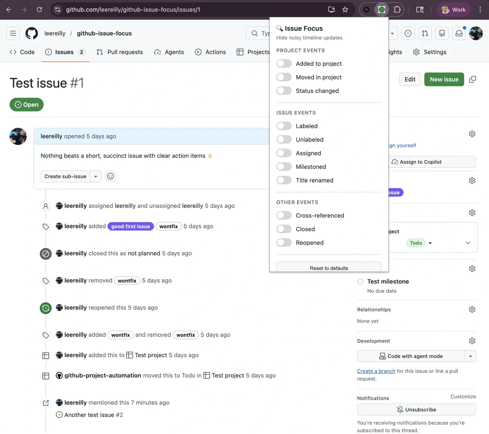

# GitHub Issue Focus

GitHub Issue Focus is a [Chrome extnsion](https://chromewebstore.google.com/detail/github-issue-focus/oglmkaafpnkanegndcglfnmengaecfak?hl=en&authuser=0) that cleans up noisy issue and pull request timelines so you can actually follow the conversation.

Instead of wading through endless "added to project", "labeled", and "status changed" updates, you will see the signal. Real discussion, decisions, and context.

**Less noise. More clarity.**

[Install it Via the Chrome Web Store](https://chromewebstore.google.com/detail/github-issue-focus/oglmkaafpnkanegndcglfnmengaecfak?hl=en&authuser=0). Take it for a spin on [this issue](https://github.com/leereilly/github-issue-focus/issues/1) - see how it compares before and after 🔎

## ✨ Why you will love it

- 🧹 **Instantly declutter timelines**  
  Hide repetitive, automated updates that do not add value to you.

- 🎯 **Focus on real conversations**  
  Surface the comments and changes that actually matter.

- ⚡ **Works automatically**  
  No setup required. Install and your GitHub issues are instantly cleaner.

- 🎛️ **Fully customizable**  
  Choose exactly which events to hide or show.

---

## 🔍 What it filters

Hide common timeline noise like:

- Project changes (added, moved, status updates)
- Label changes (added and removed)
- Assignments and milestones
- Title edits
- Other routine automation events

Keep important signals like:

- 💬 Comments and discussions  
- 🔗 Cross-references  
- ✅ Closed and reopened events  

## 🔒 Privacy first

- No tracking  
- No analytics  
- No data collection  
- Everything runs locally in your browser  

## 🧩 Perfect for

- Developers reviewing issues and PRs  
- Maintainers managing busy repositories  
- Anyone tired of GitHub timeline noise  

## Installation

### Via the Chrome Web Store

[Click here](https://chromewebstore.google.com/detail/github-issue-focus/oglmkaafpnkanegndcglfnmengaecfak?hl=en&authuser=0)

### From Source (Developer Mode)

1. Clone or download this repository
2. Open Chrome and navigate to `chrome://extensions/`
3. Enable **Developer mode** (toggle in top right)
4. Click **Load unpacked**
5. Select the `gh-issue-cleaner-upper` folder

### Usage

1. Click the extension icon in your Chrome toolbar
2. Toggle which timeline events you want to hide
3. Changes apply immediately to all open GitHub issue pages

## Configuration

| Filter | Default | Description |
|--------|---------|-------------|
| Added to project | ✅ Hidden | "added this to Project" events |
| Moved in project | ✅ Hidden | "moved this to Status" events |
| Status changed | ✅ Hidden | Project status field changes |
| Labeled | ✅ Hidden | Label additions |
| Unlabeled | ✅ Hidden | Label removals |
| Assigned | ✅ Hidden | Assignment changes |
| Milestoned | ✅ Hidden | Milestone additions |
| Title renamed | ✅ Hidden | Issue title changes |
| Cross-referenced | ❌ Shown | Mentions from other issues/PRs |
| Closed | ❌ Shown | Issue closed events |
| Reopened | ❌ Shown | Issue reopened events |

## License

MIT

## Privacy Policy

GitHub Issue Focus respects your privacy.

### Data Collection

This extension does not collect, store, transmit, or share any personal data.

### How the Extension Works

GitHub Issue Focus runs entirely in your browser. It modifies the visual presentation of GitHub issue pages by hiding selected timeline events based on your preferences. All processing happens locally on your device.

### Data Storage

Any settings or preferences (such as which timeline events are hidden) are stored locally using Chrome’s extension storage. This data never leaves your browser and is not accessible to the developer or any third party.

### Third-Party Services

This extension does not use analytics, tracking tools, advertising networks, or external APIs.

### Permissions

The extension only requests the minimum permissions necessary to function on GitHub issue pages. These permissions are used solely to modify page content and provide the extension’s features.

### Changes to This Policy

If this privacy policy changes in the future, updates will be reflected in the project repository.

### Contact

If you have questions or concerns about this privacy policy, you can open an issue on the project’s GitHub repository.

Built using [GitHub Copilot CLI](https://github.com/features/copilot/cli) for the [GitHub Copilot CLI Challenge](https://dev.to/leereilly/i-built-a-chrome-extension-to-hide-noisy-github-issue-timeline-events-with-copilot-cli-255m).
